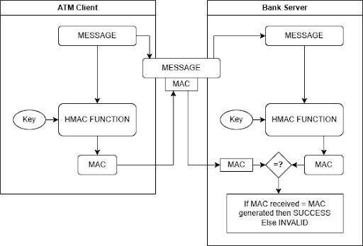
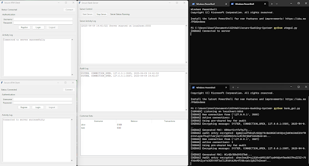

# 💳 Secure-Banking-System

This project simulates a **secure client-server banking system** where ATM clients interact with a centralized bank server to perform essential banking operations. The system is protected by encryption and authentication protocols, ensuring data privacy and integrity.

## 🖼️ System Preview

Below is a screenshot of the system in action, showing both the ATM client GUI and the command-line interface for the server:

## 🔐 Security Mechanism

The diagram below shows how message authentication is ensured between the ATM client and the bank server using HMAC (Hash-based Message Authentication Code):

## 🛡️ Features

- 🔐 Encrypted communication between ATM clients and the bank server  
- 👤 User registration and login  
- 💰 Deposit and withdrawal functionality  
- 📈 Balance inquiry  
- 📜 Encrypted audit logs for all transactions  

## 📂 Project Structure

- `atm_client.py`  
  > ATM client application with a GUI and secure communication logic.

- `bank_server.py`  
  > Bank server that handles client requests and maintains secure, encrypted transaction records.

- `audit.log`  
  > Encrypted log file that is automatically generated to track all user transactions securely.
